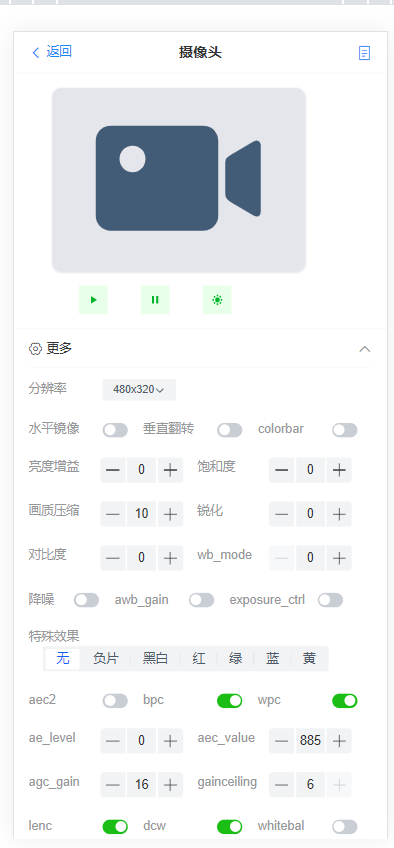
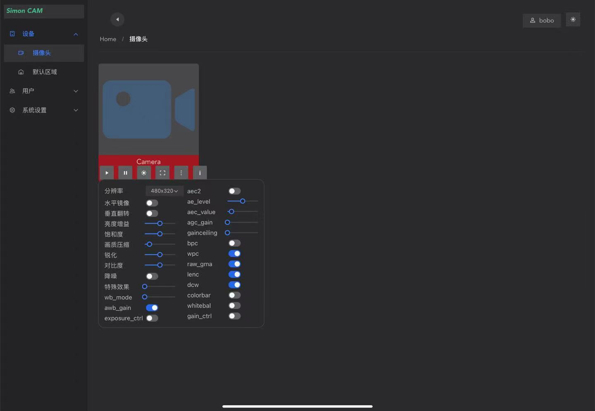
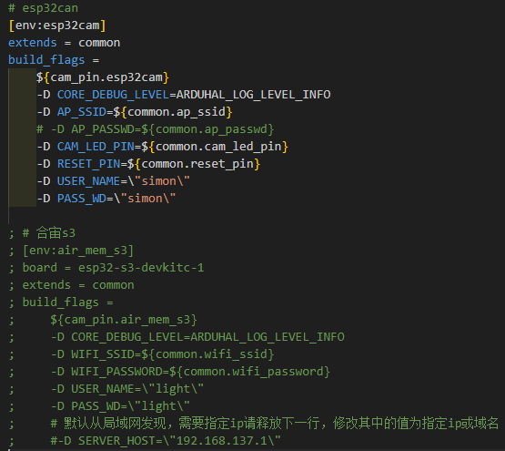
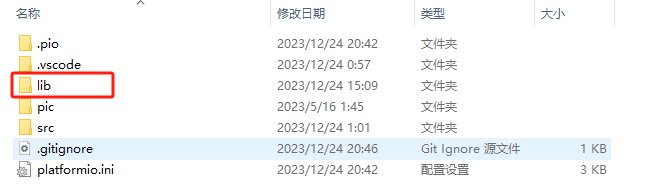
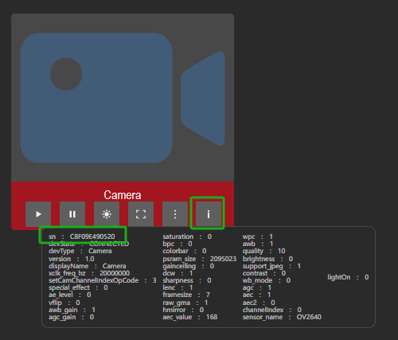

## ESP32远程图传

- [x] 支持esp32cam或者合宙esp32s3
- [x] 支持多个esp32cam连接同一服务端，集群式管理
- [x] 支持esp32通过Web配置WIFI
- [x] esp32WiFi断连后自动重新配置连接
- [x] 可在局域网或者公网使用
- [x] 支持移动端的web和PC端web查看视频和控制
- [x] 支持远程控制闪光灯
- [x] 支持视频流地址访问，可将视频窗口单独嵌入个人网页


### 效果

<center class="half"> </center>

<center class="half"></center>

需要确保足够的供电 和芯片以及摄像头得到良好的散热 ，以及较好的信号，以确保从esp32到服务端这一段的流畅。可外接ipex天线，增强信号。

由于esp32无法编码视频，较大分辨率会带来较大带宽占用，或者小分辨率情况下加大缓存数量和时钟频率也会带来很大的数据量，比如在使用OV2640时将时钟频率设置为30M fb_cout适当加大， 每帧32KB 时可达38fps， 一秒数据量大约是1MB，转为带宽Mbps则是8M带宽。


### 安装

#### ESP32端

采用`platformio`开发

- 在`platformio.ini`中修改自定义参数。



- 其中的两个环境配置根据需求使用，对应`esp32cam`与合宙`esp32s3`.

- 该项目需要`ArduinoJson`库和`pubsubclient`库，下载[库文件压缩包](https://github.com/666zhaobo666/SimonCamServer/releases/download/v1.0.0/libraries.zip)后，解压其中的库文件，将两个库文件夹放入项目根目录下的`lib`文件夹中。

  <center class="half"> </center>

<center class="half"> </center>

- 编译后`upload`！


#### 服务端

**Windows端：**

- 下载 服务端 后解压！

- 需要安装Windows版的<span style="color:#CC1544"> **jdk17**</span>，[下载地址](https://aka.ms/download-jdk/microsoft-jdk-17.0.9-windows-x64.msi)

- 修改服务端 `bin` 目录下的 `run.bat` 文件

  ```bat
  set java="C:\Program Files\Microsoft\jdk-21.0.1.12-hotspot\bin\java"
  // 此处路径指向pc安装java17的java.exe文件路径
  ```

- 运行run.bat脚本，访问 http://localhost:8002 访问web界面。


**Linux端：**

- 需要安装`jdk17`和`unzip`服务，按照下面的步骤进行安装

  ```shell
  sudo apt update
  sudo apt install unzip
  sudo apt install openjdk-17-jdk
  ```

- 下载`Esp32CamServer`,并解压

  ```shell
  wget https://github.com/666zhaobo666/SimonCamServer/releases/download/v1.0.0/Esp32CamServer.zip
  mkdir cam-server
  mv Esp32CamServer.zip cam-server/
  cd cam-server
  unzip Esp32CamServer.zip
  ```

- 运行

  ```shell
  ./bin/run.sh
  ```

  可以使用 `screen` 或者 `nohup` 在后台运行。

- 访问

  `web` 端口 8002。

  本地则运行：http://127.0.0.1:8002

  公网则运行：[http://公网ip:8002](http://127.0.0.1:8002)


### Server 端默认账户

- 用户：`admin`
- 密码：`simon123`


### 端口说明

| 协议  | 端口号 | 说明                                         |
| ----- | ------ | -------------------------------------------- |
| `tcp` | 8002   | web服务端口                                  |
| `tcp` | 8003   | 视频服务端口，用于web请求视频                |
| `tcp` | 8081   | 设备接入后，和服务端回调设备                 |
| `udp` | 8004   | 设备推送摄像头图片帧端口                     |
| `udp` | 8003   | simonCAM handle以udp方式获取视频图片帧的端口 |


### 关于视频流访问

每个esp32的`mac`地址是不一样的，通过8003端口即可访问视频流。

例如摄像头1的mac地址是 C8F09E490520，那么通过以下地址即可访问：http://127.0.0.1:8003/video/C8F09E490520，如果部署在公网，那么使用公网IP就可以：[http://公网IP:8003/video/C8F09E490520](http://127.0.0.1:8003/video/C8F09E490520)

每次esp32接入服务器就会打印设备的`mac`地址。

**mac地址在哪里找到呢？**

在`web`端摄像头的信息页面就可以看到。

<center class="half"> </center>


### 关于视频窗口的嵌入

该视频流允许跨域，在自己的网页里面添加 `img` 标签即可，不用`iframe` 标签。

例如：新建一个 `html` 文件内填入以下内容，替换`img` 标签的 `src` 属性即可。

```html
<!DOCTYPE html>
<html lang="en">
<head>
    <meta charset="UTF-8">
    <title>我的摄像头</title>
    <style>
        .videoContainer{
            display: inline-block;
        }
    </style>
</head>
<body>
<div style="padding: 0;margin:30px auto; width: 1300px">
    <div class="videoContainer">
        
    </div>
    <div class="videoContainer">
        
    </div>
</div>

</body>
</html>
```

打开网页就可以看到 `esp32cam` 的画面。我这里只有一个 esp32Cam，所以只有一个画面：

<center class="half"> </center>

同时也可以将其植入其他任何web前端，动态打开每个摄像头。


### 帧率问题

由于`esp32`无法编码视频，较大分辨率会带来较大带宽占用，或者小分辨率情况下加大缓存数量和时钟频率也会带来很大的数据量，比如在使用 `OV2640` 时将时钟频率设置为`30M`,  `fb_cout` 适当加大， 每帧 `32KB ` 时可达`38fps` ， 一秒数据量大约是`1MB` ，转为带宽`Mbps` 则是`8M` 带宽。

普通云服务器可能带宽并不够支持较多 `esp32` 同时查看监控，同时成本也比较高，不像一些摄像头厂商提供**免费**的视频服务，这里成本需要考虑。当然实际使用二十多帧也可满足基本使用了，可以降低分辨率到 `480 * 320`  ，`4M` 服务端大体上也能满足使用。